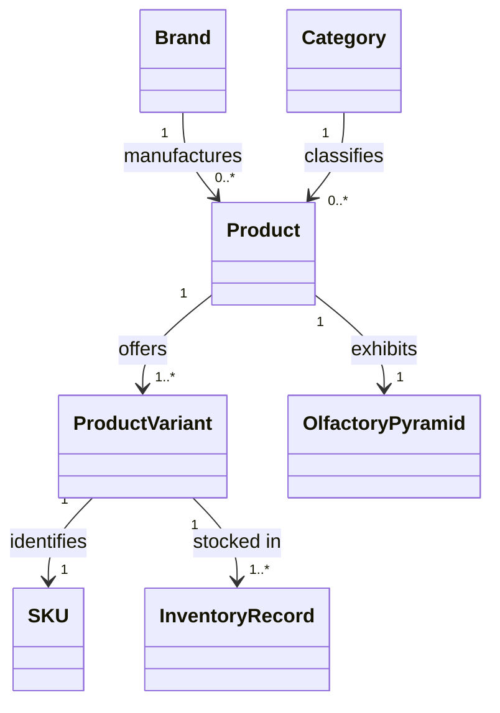
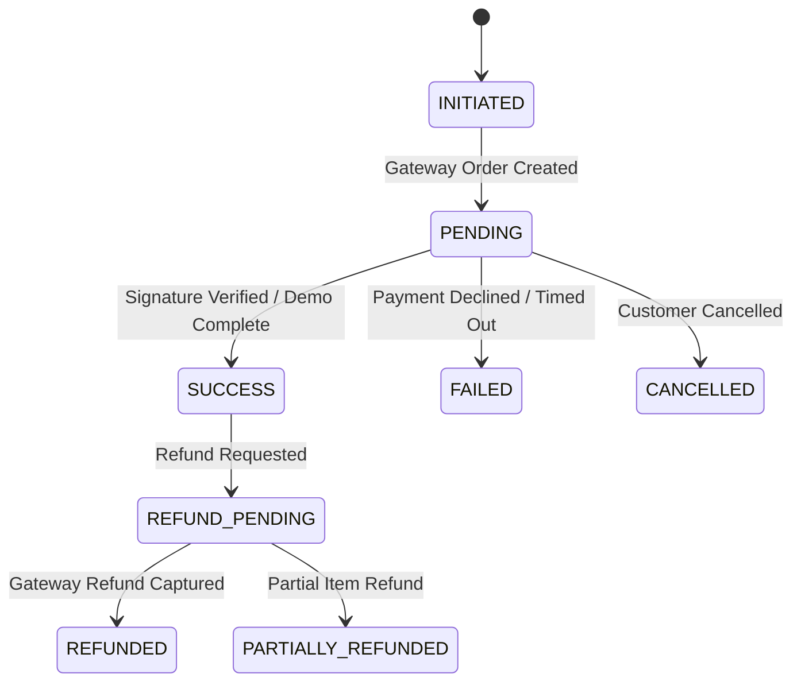
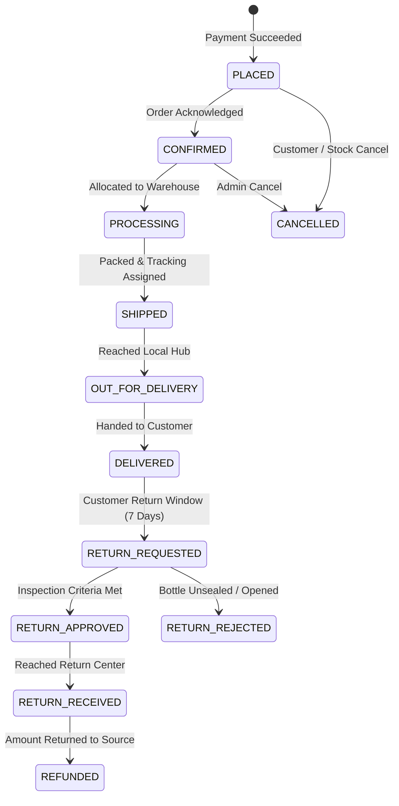
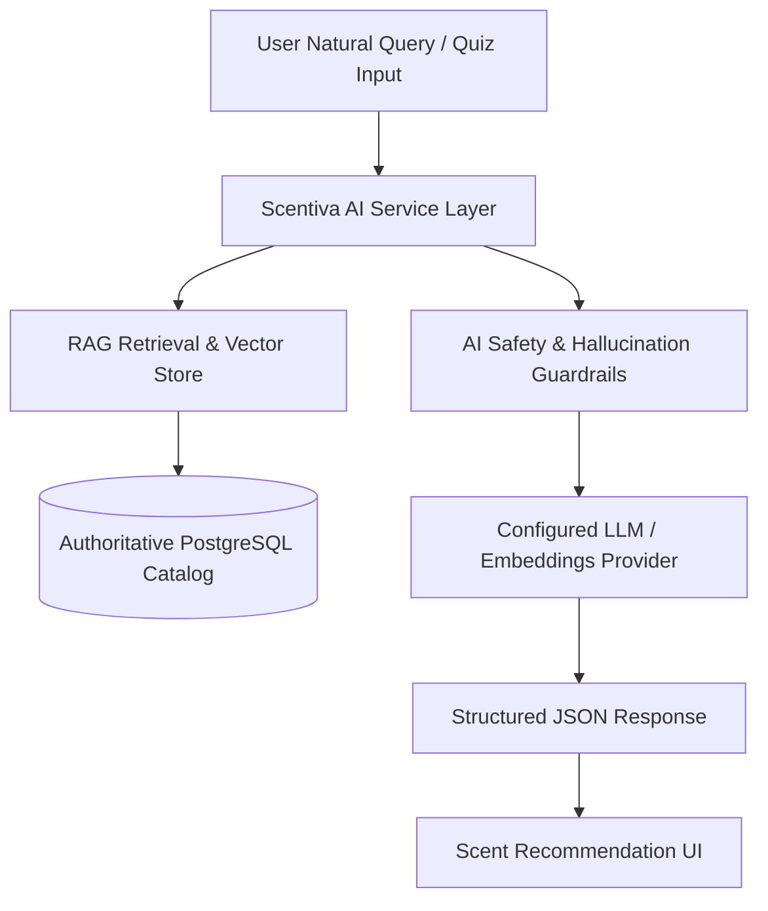

# SCENTIVA — Software Requirements Specification (SRS)
> **Document Version:** 1.0.0-RELEASE  
> **Target Release:** 2026-Q4 Production Horizon  
> **System Name:** SCENTIVA — Haute Parfumerie & Multi-Brand Fragrance Platform  
> **Status:** Approved / Baseline Architecture  
> **Repository:** [https://github.com/OnkarGulhane/Scentiva](https://github.com/OnkarGulhane/Scentiva)  

---

## 1. Document Control

| Revision | Date | Author / Role | Description of Change | Status |
|---|---|---|---|---|
| `1.0.0` | 2026-10-01 | Lead Product & Software Architect | Initial Master Specification based on Master E-Commerce 2026 Blueprint & Scentiva Decisions | Approved |
| `1.1.0` | 2026-10-03 | Principal Software Engineer | Added Section 14.2 & 14.3: Customer Authentication, Dual Sign In / Create Account Lifecycle, Guest Cart Preservation & Checkout Guard Specifications | Approved |

---

## 2. Executive Summary

**SCENTIVA** is an enterprise-grade, mobile-first haute parfumerie and multi-brand fragrance e-commerce platform. Scentiva operates as a first-party curated fragrance merchant—directly sourcing, inventorying, fulfilling, and warranting 100% authentic luxury fragrances from premier global and artisan perfumery houses (e.g., Dior, Chanel, Creed, Maison Margiela, Byredo, Tom Ford, and niche independent ateliers). 

The platform pairs a bespoke client-side shopping experience—featuring interactive WebGL 3D flacon visualization, olfactory pyramid navigation, and an intelligent scent discovery engine—with an enterprise-ready **Java Spring Boot Modular Monolith** backend, **PostgreSQL** relational database with decimal-exact accounting, and flexible external provider abstractions.

---

## 3. Purpose

This Software Requirements Specification (SRS) establishes the definitive, complete, and unambiguous functional, technical, data, security, operational, and architectural requirements for the Scentiva platform. It serves as the primary contract between Product Management, Engineering, Quality Assurance, and Operations for all subsequent implementation phases.

---

## 4. Scope

### In-Scope
1. **Customer Experience:** Mobile-first responsive web storefront (prerendered via Next.js 14 App Router), product catalog discovery, olfactory search, 5-step fragrance quiz, persistent cart, customer accounts, multi-address management, checkout orchestration, payment execution, order tracking, returns/refunds, reviews, and editorial masterclasses.
2. **Catalog & Merchandising:** Multi-tier brand taxonomy, gender/family categorization, multi-variant sizing (e.g., 30ml, 50ml, 100ml, 200ml coffrets), concentration classifications (EDT, EDP, Parfum, Extrait), olfactory pyramid note mapping (Top, Heart, Base), and batch code traceability.
3. **Inventory & Warehouse Operations:** Real-time stock reservation, low-stock threshold alerting, multi-warehouse location readiness (Pune, Mumbai, Delhi), immutable inventory movement audit ledgers, and concurrent race-condition prevention.
4. **Order Management & Fulfillment:** Multi-step transactional checkout pipeline, coupon validation engine, snapshot-based historical immutability, payment gateway integration, shipping provider abstraction, and returns/refunds workflow.
5. **Backoffice Administration Console:** Role-Based Access Control (RBAC), product and variant CRUD, stock adjustments, order fulfillment pipeline, customer registry, campaign/promotion management, CMS publishing, and business intelligence dashboards.
6. **AI-Assisted Capabilities:** AI Olfactory Search, Conversational Fragrance Concierge, Automated SEO & Product Copy Generation (with Human-in-the-Loop review), and Review Sentiment Analytics.
7. **Production Engineering:** Containerization (Docker), zero-trust security hardening, CI/CD automated test gates, structured observability, and multi-environment deployment topology.

### Out-of-Scope
- Third-party independent seller/vendor portal (Scentiva is a direct merchant, not an open multi-vendor marketplace).
- In-house physical fragrance formulation/manufacturing workflows.
- Native mobile binary apps (iOS/Android native apps are planned for post-2026 phase; responsive mobile web is the primary target).

---

## 5. Product Vision & Value Proposition

```text
+-----------------------------------------------------------------------------+
|                                SCENTIVA VISION                              |
|   "Democratizing and elevating the luxury fragrance discovery experience"   |
+-----------------------------------------------------------------------------+
                                       |
          +----------------------------+----------------------------+
          v                                                         v
  [ Digital Luxury ]                                     [ Operational Rigor ]
  - 3D WebGL Flacon Interaction                          - Decimal-Exact Financials
  - Olfactory Note Pyramids                              - Pessimistic/Optimistic Stock Locks
  - AI Scent Sommelier Quiz                              - Immutable Order Snapshots
  - Editorial Fragrance Masterclasses                    - Provider-Agnostic Abstraction
```

---

## 6. Scentiva Business Context & Merchant Model

Unlike peer-to-peer marketplaces, **Scentiva assumes 100% merchant liability and inventory ownership**:
- **Authentication Guarantee:** Scentiva verifies batch codes and maintains direct authorized distributor relationships.
- **Unified Fulfillment:** All orders are packed in temperature-controlled warehouses to preserve delicate fragrance oils and dispatched in signature luxury coffrets.
- **Centralized Catalog:** Product taxonomy, pricing, imagery, and olfactory data are centrally governed and moderated by Scentiva's catalog team.

---

## 7. Goals and Success Criteria

| Goal ID | Objective | Quantitative Target / Success Metric |
|---|---|---|
| `GOAL-01` | High Performance Digital Storefront | Lighthouse Performance >= 95, LCP < 1.8s, CLS = 0 |
| `GOAL-02` | Zero Financial / Inventory Inconsistency | 0 negative stock occurrences, 100% transaction balance |
| `GOAL-03` | Seamless Multi-Device Experience | 100% responsive parity from 360px mobile to 4K desktop |
| `GOAL-04` | High Checkout Reliability | < 0.1% checkout drop-off due to system or gateway errors |
| `GOAL-05` | Test Coverage | >= 85% branch coverage on backend business services |

---

## 8. Stakeholders

1. **Online Customers (Connoisseurs & Shoppers):** Demand high-speed discovery, authentic descriptions, transparent notes, and secure checkout.
2. **Operations & Fulfillment Teams:** Require accurate inventory levels, streamlined dispatch packing slips, and rapid tracking status updates.
3. **Store Merchandisers & Marketing:** Demand flexible promotion rules, dynamic banner controls, and AI-assisted copywriting tools.
4. **Customer Concierge Support:** Needs instant access to customer order timelines, shipment tracking, and return authorization tools.
5. **System Administrators & Security Engineers:** Demand strict RBAC, automated vulnerability scans, and comprehensive audit trails.

---

## 9. User Roles & RBAC Matrix

```text
[ Anonymous User ] ---> [ Authenticated Customer ]
                               |
[ System Users ] ------> [ Admin / Manager / Product Mgr / Order Mgr ]
```

| Role | Description | Permissions |
|---|---|---|
| `ROLE_ANONYMOUS` | Unauthenticated visitor browsing storefront | Browse catalog, search, use scent quiz, view stories, add to local cart. |
| `ROLE_CUSTOMER` | Registered fragrance buyer | Save addresses, persist cart/wishlist, place orders, view order history, submit reviews. |
| `ROLE_ORDER_MANAGER` | Fulfillment & warehouse specialist | View orders, update shipment tracking, process returns, initiate approved refunds. |
| `ROLE_PRODUCT_MANAGER` | Catalog curator & copywriter | Manage brands, categories, products, variants, olfactory pyramids, upload media. |
| `ROLE_MARKETING_MANAGER` | Promotion & content manager | Create coupons, configure campaign banners, edit stories/CMS, review AI copy. |
| `ROLE_ADMIN` | Executive administrator | Full operational permissions across all modules, view financials, manage staff users. |
| `ROLE_SUPER_ADMIN` | Platform owner / DevOps | System configuration, database maintenance, security keys, audit logs, feature flags. |

---

## 10. Assumptions

- `ASSUMP-01`: Standard Internet and modern WebGL-capable browsers (Chrome, Safari, Firefox, Edge) are used; graceful fallbacks are provided for non-WebGL devices.
- `ASSUMP-02`: Indian Rupee (INR / ₹) is the primary base operational currency, formatted using exact decimal representation.
- `ASSUMP-03`: Customer authentication will leverage stateful HTTP-only JWTs or session cookies with CORS pre-flight support.

---

## 11. Constraints

- `CONST-01`: **No Microservice Overhead:** Initial architecture must remain a single, clean Spring Boot Modular Monolith.
- `CONST-02`: **No Floating-Point Money:** All financial computations (prices, taxes, discounts, delivery fees) must use `BigDecimal` / `NUMERIC(12,2)`.
- `CONST-03`: **Next.js Frontend Preservation:** The existing 45-route Next.js 14 App Router frontend must be integrated cleanly via standardized REST endpoints without structural regressions.
- `CONST-04`: **Data Sovereignty:** Customer PII and order logs must be secured with encryption at rest and in transit (TLS 1.3).

---

## 12. Open Decisions & Extensibility Points

| Decision ID | Area | Context & Options | Default Working Assumption |
|---|---|---|---|
| `OD-01` | Guest Checkout | Require account creation vs allow guest checkout with email token. | **Decision:** Default to registered customer flow for MVP; guest checkout enabled via toggle. |
| `OD-02` | Tax Engine | Internal flat percentage calculation vs external tax provider (e.g. Avalara). | **Decision:** Modular internal GST tax calculator with provider abstraction. |
| `OD-03` | Search Engine | PostgreSQL `tsvector` full-text search vs Elasticsearch cluster. | **Decision:** PostgreSQL FTS + pgvector initially; OpenSearch interface abstraction. |

---

## 13. System Architecture & High-Level Block Diagram

```text
+-----------------------------------------------------------------------------------+
|                           SCENTIVA FRONTEND (Next.js 14)                          |
|  - App Router (45 Routes)  - Three.js / R3F (3D Hero)   - Tailwind CSS + Tokens   |
|  - Lenis Smooth Scroll     - GSAP Motion Framework      - Two-Phase SSR Hydration |
+-----------------------------------------------------------------------------------+
                                         |
                                         | REST API (HTTPS / JSON / OpenAPI 3.0)
                                         v
+-----------------------------------------------------------------------------------+
|                   SCENTIVA BACKEND (Spring Boot Modular Monolith)                 |
|                                                                                   |
|  [ Auth & Security ]   [ Catalog & Brands ]     [ Inventory & Warehouses ]        |
|  [ Cart & Wishlist ]   [ Checkout & Orders ]    [ Payments & Razorpay Gateway ]   |
|  [ Shipping Service ]  [ Promotions Engine ]    [ Reviews & Ratings ]             |
|  [ AI Service & RAG ]  [ Content & CMS ]        [ Audit & Observability ]         |
+-----------------------------------------------------------------------------------+
                                         |
                                         | Spring Data JPA / Hibernate
                                         v
+-----------------------------------------------------------------------------------+
|                             DATABASE (PostgreSQL 16)                              |
|  - Relational Core (30+ Tables)                 - Full-Text Search (tsvector)     |
|  - Exact Decimal Arithmetic                     - Vector Embeddings (pgvector)    |
+-----------------------------------------------------------------------------------+
```

---

## 14. Customer Experience & Storefront Specifications

### 14.1 Storefront Route Hierarchy (30 Routes)
1. `/` — Home with 3D Flacon Hero, Brand Ticker, Best Sellers, Fragrance Finder Teaser, Editorial Journal.
2. `/shop` — Catalog with faceted filters (Family, Concentration, Brand, Price range, Gender).
3. `/search` — Intelligent search with autocomplete, auto-correct, and zero-result fallback.
4. `/brands` & `/brands/[slug]` — Brand directory and dedicated brand showcase.
5. `/categories/[slug]` — Curated collections (For Her, For Him, Unisex, Luxury & Niche, Discovery Coffrets).
6. `/product/[slug]` — Dynamic Product Detail Page (PDP) with Olfactory Pyramid, size selector, batch verification, and reviews.
7. `/find-your-scent` & `/find-your-scent/results` — 5-step interactive scent quiz and recommendation engine.
8. `/cart` & `/checkout` — Bag drawer, multi-step checkout pipeline, payment options.
9. `/account/*` — Customer profile, address book, active orders, interactive shipment tracking timeline.
10. `/account/sign-in` & `/account/sign-up` — Dual-tab luxury authentication and registration portal with Privé rewards onboarding.
11. `/stories/*` — Editorial fragrance masterclasses, notes breakdowns, perfumer interviews.

---

### 14.2 Customer Authentication & Registration Specifications (Sign In & Create Account)

#### 14.2.1 Core Objectives & Architectural Rules
1. **Frictionless Onboarding:** Modern luxury e-commerce standard allowing guest browsing, adding items to bag, and completing authentication seamlessly before checkout.
2. **Unified Dual-Mode Portal:** A single consolidated interface supporting instant switching between **"Sign In"** (existing members) and **"Create Account"** (new connoisseurs) without losing context or cart contents.
3. **Cart Continuity & Guest-to-User State Preservation:** Any items added to the bag while browsing as a guest MUST persist and merge cleanly upon sign-in or account creation.
4. **Checkout Authentication Guard & Automatic Return:** When an unauthenticated visitor clicks "Proceed to Checkout" from the cart drawer or `/cart` page, they are smoothly directed to `/account/sign-in?redirect=/checkout`. Upon successful authentication, they are instantly returned to `/checkout` with their selected fragrance variants and quantities intact.

#### 14.2.2 End-to-End User Authentication Flow
```text
[ Guest Browsing ] 
       │
       ▼
[ Add Fragrance to Bag ] ──► (Stored in Client Session Cart)
       │
       ▼
[ View Cart / Bag Drawer ]
       │
       ▼
[ Click "Proceed to Checkout" ]
       │
       ▼
[ Authentication Guard Check ]
       ├── (Is Authenticated?) ──► [ Direct to /checkout ]
       └── (Is Guest?) ──────────► [ Redirect to /account/sign-in?redirect=/checkout ]
                                            │
               ┌────────────────────────────┴────────────────────────────┐
               ▼                                                         ▼
       [ Sign In Tab ]                                          [ Create Account Tab ]
       - Email & Password input                                 - Full Name (First + Last)
       - "Remember Me" toggle                                   - Email & Password input
       - Demo credentials quick-fill                            - Terms & Privé Agreement
       - Auth verification                                      - 100 Welcome Points Awarded
               │                                                         │
               └────────────────────────────┬────────────────────────────┘
                                            ▼
                               [ Authentication Success ]
                                            │
                                            ▼
                            [ Merge Guest Cart into User Account ]
                                            │
                                            ▼
                        [ Safe Return to /checkout Pipeline ]
```

#### 14.2.3 Functional UI/UX Requirements
| Feature | Requirement Specification |
|---|---|
| **Route Aliases** | `/account/sign-in`, `/account/sign-up`, `/signin`, `/signup`, `/login` all route cleanly to the unified auth experience. |
| **Tabbed Interface** | Active tab pill indicator toggling between **Sign In** and **Create Account** without page reload. |
| **Input Validation** | Real-time email syntax check, minimum 6-character password constraint, required field validations with descriptive error states. |
| **Password Visibility** | Interactive eye icon to toggle masking / unmasking of the entered password. |
| **Privé Loyalty Onboarding** | New accounts automatically initialize with **Privé Bronze** status and a **100 Points** welcome allocation. |
| **Security Redirect Guard** | Validates internal relative paths to strictly prohibit open redirect vulnerabilities. |

#### 14.2.4 Dual Backend REST API Contract
```http
POST /api/v1/auth/login
Content-Type: application/json

{
  "email": "customer@example.com",
  "password": "SecurePassword123"
}
```
*Response (`200 OK`):*
```json
{
  "success": true,
  "token": "eyJhbGciOiJIUzUxMiIsIn...",
  "user": {
    "userId": 101,
    "email": "customer@example.com",
    "fullName": "Olivia Vance",
    "role": "ROLE_CUSTOMER",
    "loyaltyTier": "PRIVE_GOLD",
    "points": 500
  }
}
```

```http
POST /api/v1/auth/register
Content-Type: application/json

{
  "firstName": "Julian",
  "lastName": "Drake",
  "email": "julian.drake@luxury.com",
  "password": "ArtisanPassword456"
}
```
*Response (`201 Created`):*
```json
{
  "success": true,
  "token": "eyJhbGciOiJIUzUxMiIsIn...",
  "user": {
    "userId": 102,
    "email": "julian.drake@luxury.com",
    "fullName": "Julian Drake",
    "role": "ROLE_CUSTOMER",
    "loyaltyTier": "PRIVE_BRONZE",
    "points": 100
  }
}
```

---

### 14.3 Customer Account & Self-Service Management (`/account`)
- **Active Orders Timeline:** Real-time visual fulfillment stepper (Placed -> Confirmed -> Shipped -> Out for Delivery -> Delivered).
- **Multi-Address Book:** CRUD management of residential and corporate shipping destinations with default designation.
- **Privé Loyalty & Points Vault:** Tier badge indicator, points balance, tier progress bar, and member-exclusive discount unlocking.
- **Wishlist Synchronizer:** Persistent multi-device fragrance bookmarking with 1-click "Move to Bag".

---

## 15. Catalog & Taxonomy Domain



### 15.1 Olfactory Pyramid Specifications
Each fragrance product specifies an exact three-tier scent profile:
- **Top Notes (Head):** Rapidly evaporating opening notes (e.g., Calabrian Bergamot, Pink Pepper, Sicilian Lemon). Scent duration: 0–15 mins.
- **Heart Notes (Heart/Middle):** Core personality and character (e.g., Grasse Rose, Lavender, Nutmeg, Geranium). Scent duration: 15–120 mins.
- **Base Notes (Dry Down):** Deep fixatives and lingering warmth (e.g., Ambroxan, Haitian Vetiver, Cedarwood, Vanilla). Scent duration: 2–24 hours.

---

## 16. Products, Variants & SKU Architecture

```text
Product: "Sauvage" (Dior)
   ├── Variant 1: 30 ml Extrait de Parfum (SKU: DIOR-SAUV-EDP-30ML)  - Price: ₹6,500
   ├── Variant 2: 60 ml Extrait de Parfum (SKU: DIOR-SAUV-EDP-60ML)  - Price: ₹9,800
   └── Variant 3: 100 ml Extrait de Parfum (SKU: DIOR-SAUV-EDP-100ML) - Price: ₹13,500
```

- Every variant possesses an immutable SKU, barcode (EAN-13), volume in milliliters, concentration enum (`EDC`, `EDT`, `EDP`, `PARFUM`, `EXTRAIT`), base price, sale price, and weight for shipping calculations.

---

## 17. Inventory Management & Multi-Location Architecture

```text
[ Product Variant: SKU-100ML ]
             |
             +---> [ Inventory: Pune Main WH ]      (Qty: 45, Reserved: 3)
             +---> [ Inventory: Mumbai Express WH ] (Qty: 20, Reserved: 0)
             +---> [ Inventory: Delhi Hub WH ]      (Qty: 15, Reserved: 1)
```

### 17.1 Stock Lifecycle Rules
1. **Available Stock Formula:** $\text{Available} = \text{QuantityOnHand} - \text{QuantityReserved}$.
2. **Reservation at Checkout:** When a customer initiates checkout payment, an atomic reservation lock is acquired with a 15-minute TTL.
3. **Pessimistic Locking:** Concurrency conflicts are prevented using database row-level locking (`SELECT ... FOR UPDATE`).
4. **Movement Audit Trail:** Every single addition, deduction, reservation, return, or scrap is recorded in `inventory_movements` with user attribution and reason code.

---

## 18. Cart & Wishlist Domain

- **Backend Authoritative Pricing:** The frontend cart is merely a presentation mirror. Upon any mutation, the backend recalculates line totals, checks variant active status, verifies live stock availability, and computes applicable tax and tier discounts.
- **Wishlist Isolation:** Wishlist items link to `ProductVariant` (or base `Product` with default variant) and trigger automated back-in-stock alerts.

---

## 19. Checkout Orchestration Pipeline

```text
[ Cart Review ]
       │
       ▼
[ Select / Add Address ] ──► (Validates Pincode Serviceability)
       │
       ▼
[ Apply Coupon ] ──────────► (Validates Minimum Spend, User Limits, Expiry)
       │
       ▼
[ Calculate Taxes & Shipping ] (Dynamic Free Shipping Threshold check)
       │
       ▼
[ Reserve Inventory ] ─────► (Atomic Row-Lock with 15-Min Hold)
       │
       ▼
[ Payment Execution ] ─────► (Demo Gateway / Razorpay Server Verification)
       │
       ▼
[ Order Confirmed & Snapshot Saved ]
```

---

## 20. Pricing, Discounts & Coupon Engine

- **Discount Types:** Flat Amount Discount (`FLAT_AMOUNT`), Percentage Discount with Cap (`PERCENTAGE`), and Free Shipping (`FREE_SHIPPING`).
- **Validation Rules:**
  - `MIN_ORDER_VALUE`: Minimum subtotal requirement.
  - `USAGE_LIMIT_GLOBAL`: Maximum total redemptions across all users.
  - `USAGE_LIMIT_PER_USER`: Maximum redemptions per authenticated customer account.
  - `CATEGORY_EXCLUSION`: Niche luxury brands may be excluded from general promotional coupons.

---

## 21. Payment Gateway & Transaction Domain



### 21.1 Provider Abstraction Interface
```java
public interface PaymentProvider {
    PaymentOrderResponse createPaymentOrder(PaymentOrderRequest request);
    PaymentVerificationResponse verifyPayment(PaymentVerificationRequest request);
    RefundResponse processRefund(RefundRequest request);
}
```
- **Initial:** `DemoPaymentProvider` (instant test sandbox).
- **Future:** `RazorpayPaymentProvider` (HMAC SHA-256 signature verification and webhook listeners).

---

## 22. Order Domain & Historical Snapshot Immutability

### 22.1 Immutability Rule
When an order is created, the system stores **complete immutable JSON snapshots** of:
1. `customer_snapshot`: Full customer name, verified email, phone.
2. `shipping_address_snapshot`: Complete postal address, landmark, pincode, state at time of purchase.
3. `order_items_snapshot`: Unit price, variant title, SKU, bottle volume, discount portion, and tax breakdown.

*Subsequent modifications to product prices or customer address books never alter existing historical orders.*

---

## 23. Order Status State Machine



---

## 24. Shipping & Logistics Abstraction

- **Abstraction Interface:** `ShippingProvider` with implementations `ManualShippingProvider` (internal courier notes) and `ShiprocketProvider` (automated AWB generation and webhook tracking).
- **Serviceability Engine:** Validates pincodes against hazardous materials (perfumes containing alcohol) air/surface cargo regulations.

---

## 25. Returns, Refunds & Authenticity Verifications

- **Hygiene & Seal Policy:** Due to the luxury nature of fragrances, returns are permitted within 7 calendar days only if the security tamper seal and outer cellophane packaging remain intact.
- **Batch Code Verification:** Return intake inspection validates that the returned bottle's batch code matches the original shipment ledger.

---

## 26. Customer Reviews & Verified Buyer Badging

- **Verified Purchase Requirement:** Reviews can only be submitted by customer accounts with an associated `DELIVERED` order containing the specific SKU.
- **Moderation Workflow:** All user-submitted text and images pass through an automated profanity/spam filter and require product manager approval before appearing on the public PDP.

---

## 27. Content Management System (CMS) & Masterclasses

- **Managed Entities:** Hero banners, promotional announcement ribbons, footer legal links, FAQ accordions, and `/stories` editorial masterclass articles.
- **Editorial Richness:** Supports structured sections, note breakdowns, perfumer quotes, and direct shoppable product callout embeds.

---

## 28. SEO & Schema.org Structured Data

- **Dynamic Metadata:** Automated OpenGraph and Twitter card image generation.
- **Schema.org JSON-LD Types:**
  - `Product`: Name, SKU, brand, olfactory notes, offer price, currency (`INR`), availability (`InStock`).
  - `BreadcrumbList`: Complete navigation path.
  - `Organization`: Scentiva luxury brand details and concierge contact points.
  - `Article`: Editorial masterclass stories schema.

---

## 29. Media Storage & Delivery Abstraction

```text
StorageProvider Interface
   ├── LocalStorageProvider (Development / Testing)
   └── ObjectStorageProvider (Production AWS S3 / Cloudflare R2 / MinIO)
```
- Supported MIME types: `image/webp`, `image/avif`, `image/jpeg`, `image/png`, `video/mp4`.
- Maximum upload size: 5 MB for images, 50 MB for fragrance videos.
- Automatic generation of responsive thumbnails (150px, 400px, 800px, 1200px).

---

## 30. Backoffice Admin Operations Console

```text
/admin
  ├── /dashboard       - Gross revenue, AOV, order velocity, conversion rates
  ├── /products        - Product catalog table, price editor, batch updates
  ├── /products/new    - Multi-step product and olfactory pyramid creator
  ├── /inventory       - Real-time stock levels, low-stock warnings, manual adjustments
  ├── /orders          - Fulfillment pipeline, dispatch labels, return approvals
  ├── /customers       - Customer spend tiers, order history, VIP tags
  ├── /promotions      - Coupon creation, discount rules, usage analytics
  ├── /content         - Stories editor, banner manager, FAQ publisher
  └── /settings        - Store configuration, tax rates, shipping thresholds
```

---

## 31. Telemetry, Analytics & 17-Event Bus

The platform dispatches structured, privacy-compliant events across both frontend and backend:

```text
 1. page_view           7.  remove_from_cart     13. order_placed
 2. product_view        8.  view_cart            14. order_cancelled
 3. category_view       9.  begin_checkout       15. search_query
 4. brand_view          10. add_shipping_info    16. quiz_started
 5. wishlist_add        11. add_payment_info     17. quiz_completed
 6. add_to_cart         12. coupon_applied
```

---

## 32. AI Architecture & Scent Discovery Concierge



### 32.1 AI Principles & Guardrails
1. **Zero Hallucination on Catalog Truth:** The AI engine is strictly prohibited from inventing prices, stock, or nonexistent perfumes. All product identifiers must resolve to real database records.
2. **Human-in-the-Loop Content Workflow:** AI-generated SEO descriptions and marketing summaries require administrative review and approval before publication.
3. **Prompt Injection Defense:** Strict input sanitization and parameter encapsulation for all conversational inputs.

---

## 33. Security, Authentication & Zero-Trust Architecture

- **Password Security:** BCrypt hashing with a work factor of 12.
- **Session Management:** Stateless JSON Web Tokens (JWT) signed with HMAC SHA-512 or RSA-256; distributed via secure, HTTP-only, SameSite=Strict cookies.
- **API Guardrails:**
  - Rate Limiting: 100 req/min for standard endpoints; 5 req/min for auth and checkout submission.
  - SQL Injection Defense: 100% parameterized queries via Spring Data JPA / Hibernate.
  - XSS & CSRF Defense: Content Security Policy (CSP), sanitization of rich text, strict CORS origins.

---

## 34. Backend Engineering & Modular Monolith Layering

```text
src/main/java/com/scentiva/
  ├── config/          # Security, Web, CORS, Swagger, Async configs
  ├── common/          # Global exceptions, ApiResponse<T>, BaseEntity
  ├── modules/
  │     ├── auth/        # Users, Roles, JWT, AuthController
  │     ├── catalog/     # Brands, Categories, Products, Pyramids, Variants
  │     ├── inventory/   # InventoryRecords, StockMovements, Warehouses
  │     ├── cart/        # Cart, CartItems, PriceCalculator
  │     ├── order/       # Orders, OrderItems, OrderStateMachine
  │     ├── payment/     # Payments, Transactions, PaymentProviders
  │     ├── shipping/    # Shipments, AWB, ShippingProviders
  │     ├── promotion/   # Coupons, CampaignRules, DiscountEngine
  │     ├── review/      # Reviews, Ratings, Moderation
  │     ├── content/     # Stories, Banners, CMS
  │     ├── ai/          # Recommendations, SearchEmbedding, PromptEngine
  │     └── admin/       # DashboardMetrics, StaffManagement
  └── ScentivaApplication.java
```

---

## 35. Frontend Architecture & Next.js 14 Integration

- **Framework:** Next.js 14 App Router with React 18 and TypeScript 5.5 (`strict: true`).
- **Styling:** TailwindCSS v3.4 + Custom Nocturne Gallery Design Tokens (`tokens.css`, `index.css`).
- **3D Hero Canvas:** React Three Fiber (`@react-three/fiber`, `@react-three/drei`) with calibrated camera (`position: [0, 0, 5.2]`, `FOV: 46°`, 0% bottle clipping) and `IntersectionObserver` GPU throttling when offscreen.
- **Hydration Safety:** Two-phase SSR hydration (`safeGetStorage` + post-mount synchronization) to eliminate React hydration mismatch errors.
- **Typed API Gateway:** Client gateway in `src/lib/api/apiClient.ts` with retry policies and timeout management.

---

## 36. Database Architecture & Conceptual Data Model (30+ Entities)

```text
Entities Specification:
1.  users (id, email, password_hash, role, status, created_at)
2.  customers (id, user_id, first_name, last_name, phone, loyalty_tier)
3.  addresses (id, customer_id, address_line1, address_line2, city, state, postal_code, is_default)
4.  brands (id, name, slug, origin_country, description, logo_url, tier, is_active)
5.  categories (id, name, slug, description, image_url, display_order, is_active)
6.  products (id, brand_id, category_id, name, slug, description, gender, is_featured, is_active)
7.  olfactory_pyramids (id, product_id, top_notes, heart_notes, base_notes, fragrance_family)
8.  product_variants (id, product_id, sku, volume_ml, concentration, base_price, sale_price, is_active)
9.  product_images (id, product_id, variant_id, image_url, is_primary, display_order)
10. warehouses (id, code, name, city, state, is_active)
11. inventory_records (id, variant_id, warehouse_id, quantity_on_hand, quantity_reserved, low_stock_threshold)
12. inventory_movements (id, variant_id, warehouse_id, change_qty, reason, reference_id, created_at)
13. carts (id, customer_id, session_id, updated_at)
14. cart_items (id, cart_id, variant_id, quantity, unit_price_at_addition)
15. wishlists (id, customer_id, updated_at)
16. wishlist_items (id, wishlist_id, variant_id, created_at)
17. orders (id, order_number, customer_id, status, subtotal, discount, delivery_fee, tax, total, created_at)
18. order_items (id, order_id, variant_id, sku, product_name, variant_title, unit_price, quantity, total_price)
19. order_snapshots (id, order_id, customer_data_json, shipping_address_json, pricing_matrix_json)
20. payments (id, order_id, provider, payment_method, status, amount, currency, created_at)
21. payment_transactions (id, payment_id, transaction_ref, gateway_status, raw_response, created_at)
22. shipments (id, order_id, provider, tracking_number, status, carrier_name, dispatched_at, delivered_at)
23. shipment_events (id, shipment_id, status, location, description, timestamp)
24. coupons (id, code, discount_type, discount_value, min_order_value, max_discount, usage_limit, expires_at)
25. coupon_redemptions (id, coupon_id, customer_id, order_id, redeemed_at)
26. reviews (id, product_id, customer_id, order_id, rating, title, comment, is_verified, status, created_at)
27. stories (id, title, slug, excerpt, content_markdown, cover_image, author, is_published, published_at)
28. banners (id, title, subtitle, target_url, image_url, position, is_active)
29. audit_logs (id, user_id, action, entity_name, entity_id, ip_address, changes_json, created_at)
30. notifications (id, customer_id, channel, subject, message_body, status, sent_at)
```

---

## 37. API Architecture & RESTful Specifications

All endpoints conform to standardized envelope responses:

```json
{
  "success": true,
  "statusCode": 200,
  "message": "Operation completed successfully",
  "data": {},
  "timestamp": "2026-10-01T12:00:00Z"
}
```

### 37.1 Primary Endpoint Catalog
- **Auth:** `POST /api/auth/register`, `POST /api/auth/login`, `POST /api/auth/refresh`, `POST /api/auth/logout`.
- **Catalog:** `GET /api/products`, `GET /api/products/{slug}`, `GET /api/brands`, `GET /api/categories`.
- **Cart & Wishlist:** `GET /api/cart`, `POST /api/cart/items`, `PUT /api/cart/items/{id}`, `DELETE /api/cart/items/{id}`.
- **Checkout & Orders:** `POST /api/checkout/validate`, `POST /api/orders`, `GET /api/orders/{id}`, `GET /api/customer/orders`.
- **Payments:** `POST /api/payments/create-order`, `POST /api/payments/verify`, `POST /api/payments/webhook`.
- **Admin:** `GET /api/admin/metrics`, `POST /api/admin/products`, `PUT /api/admin/inventory/adjust`.
- **AI:** `POST /api/ai/scent-finder`, `POST /api/ai/semantic-search`, `POST /api/ai/generate-description`.

---

## 38. External Provider Abstraction Architectures

```text
1. Payment Gateway:  PaymentProvider  ──> DemoPaymentProvider (Dev)  ──> RazorpayPaymentProvider (Prod)
2. Logistics:        ShippingProvider ──> ManualShippingProvider     ──> ShiprocketProvider (Prod)
3. Media Assets:     StorageProvider  ──> LocalDiskStorageProvider   ──> S3ObjectStorageProvider (Prod)
4. AI Concierge:     AIProvider       ──> LocalMockAIProvider        ──> OpenAI/AnthropicProvider (Prod)
5. Notifications:    NotifProvider    ──> LogNotifProvider           ──> SendGrid/TwilioProvider (Prod)
```

---

## 39. Transactional Consistency & Concurrency Protection

1. **ACID Boundaries:** Spring `@Transactional(isolation = Isolation.READ_COMMITTED)` encapsulates all order placements.
2. **Pessimistic Inventory Locking:**
   ```sql
   SELECT * FROM inventory_records WHERE variant_id = :variantId AND warehouse_id = :warehouseId FOR UPDATE;
   ```
3. **Idempotency Key Verification:** All payment submissions and order placements require a unique client-generated UUID header (`Idempotency-Key`). Subsequent duplicate calls return the cached original response without re-executing payments.

---

## 40. Fault Tolerance, Circuit Breakers & Fallbacks

- **Resilience4j Integration:** Circuit breakers configured on external payment and AI gateways (Failure threshold: 50%, Wait duration in open state: 10s).
- **Graceful Degraded States:**
  - AI unavailable $\rightarrow$ Fallback to rule-based keyword search and curated fragrance quiz results.
  - WebGL unavailable $\rightarrow$ Render high-resolution `StaticFlaconFallback` procedural canvas.

---

## 41. Observability, Logging & Audit Trails

- **Structured JSON Logging:** Logback configured with MDC (Mapped Diagnostic Context) capturing `traceId`, `userId`, `clientIp`.
- **Health & Metrics:** Spring Boot Actuator exposes `/actuator/health` and Prometheus metrics at `/actuator/prometheus`.
- **Audit Logging:** Administrative data changes (stock adjustments, price modifications, refunds) are written to immutable `audit_logs` table.

---

## 42. Performance & Scalability Specifications

- **Database Optimization:** B-Tree indexing on all foreign keys, unique slugs, and composite index `(category_id, is_active, base_price)`.
- **Connection Pooling:** HikariCP configured with maximum pool size 20, minimum idle 10, connection timeout 30,000ms.
- **Client Cache Strategy:** Next.js Static Site Generation (SSG) with Incremental Static Regeneration (ISR, `revalidate: 60`) for product and brand pages.

---

## 43. Testing & Verification Strategy

| Test Layer | Framework / Tool | Scope & Scenarios |
|---|---|---|
| **Unit Tests** | JUnit 5, Mockito | Service business logic, discount calculators, coupon rule engine. |
| **Data Layer Tests** | `@DataJpaTest`, Testcontainers PostgreSQL | Entity relationships, unique constraints, optimistic locking checks. |
| **API / Integration** | `@SpringBootTest`, MockMvc | End-to-end controller requests, RBAC authorization, validation errors. |
| **End-to-End (E2E)** | Playwright / Cypress | Complete purchase flow: Browse $\rightarrow$ Quiz $\rightarrow$ Cart $\rightarrow$ Checkout $\rightarrow$ Payment. |
| **Concurrency Tests** | JMeter / Multi-threaded JUnit | 100 simultaneous checkouts against a single remaining SKU item. |

---

## 44. Git Workflow, CI/CD & Environment Topology

```text
[ Feature Branch: feature/xyz ]
              │
              ▼ (PR + CI: Lint + Test + Docker Build)
[ Branch: main ]
              │
              ▼ (Automated Deployment)
[ Staging Environment ] ──► (E2E Acceptance Smoke Tests)
              │
              ▼ (Manual Promotion Gate)
[ Production Environment ]
```

---

## 45. Acceptance Criteria (Given-When-Then Format)

### Scenario AC-01: Concurrent Stock Purchase Prevention
- **Given** Variant SKU `CREED-AVENT-100ML` has an available quantity of 1 in the warehouse,
- **When** Customer A and Customer B simultaneously attempt to complete checkout payment for this item,
- **Then** the backend row-lock allows Customer A's transaction to complete, reserves the stock, and immediately rejects Customer B's payment attempt with error code `INSUFFICIENT_STOCK`, preventing negative inventory.

### Scenario AC-02: Backend Price Immutability
- **Given** a product price is updated in the database from ₹8,500 to ₹10,000 while in a customer's active frontend bag,
- **When** the customer submits the order request with the stale payload,
- **Then** the backend recalculates line totals using authoritative database prices, notifies the customer of the price change, and requires explicit re-confirmation.

### Scenario AC-03: Address Snapshot Immutability
- **Given** Customer places Order `#SC-8021` to Address "74 Heritage Blvd, Pune",
- **When** Customer subsequently edits their profile address to "12 Marine Drive, Mumbai",
- **Then** Order `#SC-8021` retains the original "74 Heritage Blvd, Pune" in `order_snapshots`, maintaining historical integrity.

---

## 46. Requirement Traceability Matrix (RTM)

| Req ID | Module | Requirement Description | Database Entity | Spring Boot Layer | Frontend Route | Acceptance Criteria | Phase |
|---|---|---|---|---|---|---|---|
| `AUTH-001` | Auth | Customer Registration & BCrypt Auth | `users`, `customers` | `AuthController`, `UserService` | `/account/sign-up` | Standard valid signup | Phase 2 |
| `AUTH-002` | Auth | Secure JWT Login with HTTP-Only Cookie | `users` | `SecurityFilter`, `JwtTokenProvider` | `/account/sign-in` | Valid credentials return cookie | Phase 2 |
| `CAT-001` | Catalog | Multi-Brand Taxonomy & Filtering | `brands`, `categories` | `CatalogController`, `BrandService` | `/brands`, `/shop` | Filter by tier & family | Phase 3 |
| `PROD-001` | Products | Fragrance Olfactory Pyramid | `products`, `olfactory_pyramids` | `ProductController`, `ProductService` | `/product/[slug]` | Display Top/Heart/Base notes | Phase 3 |
| `VAR-001` | Variants | Multi-size Volume & Concentration SKU | `product_variants` | `VariantService` | `/product/[slug]` | Switch 30/50/100ml dynamically | Phase 3 |
| `INV-001` | Inventory | Multi-Location Stock & Reservation | `inventory_records`, `warehouses` | `InventoryService` | `/admin/inventory` | AC-01 concurrency test | Phase 3 |
| `CART-001` | Cart | Authoritative Price & Coupon Engine | `carts`, `cart_items`, `coupons` | `CartService`, `PromotionService` | `/cart` | AC-02 price check | Phase 4 |
| `WISH-001` | Wishlist | Customer Wishlist & Stock Alert | `wishlists`, `wishlist_items` | `WishlistService` | `/wishlist` | Add/remove & move to bag | Phase 4 |
| `CHK-001` | Checkout | Multi-Step Idempotent Checkout | `orders`, `order_snapshots` | `CheckoutService` | `/checkout` | Idempotent duplicate lock | Phase 5 |
| `PAY-001` | Payments | Payment Abstraction (Demo & Razorpay) | `payments`, `payment_transactions` | `PaymentService`, `PaymentProvider` | `/checkout/payment` | Verified signature capture | Phase 6 |
| `ORD-001` | Orders | Order Lifecycle & History Snapshot | `orders`, `order_items` | `OrderService` | `/account/orders` | AC-03 snapshot verification | Phase 6 |
| `SHIP-001` | Shipping | Carrier Tracking & Pincode Service | `shipments`, `shipment_events` | `ShippingService`, `ShippingProvider` | `/account/orders/[id]` | Real-time milestone tracker | Phase 7 |
| `RET-001` | Returns | Return Authorization & Seal Check | `reviews`, `refunds` | `ReturnService` | `/account/orders` | 7-day policy validation | Phase 7 |
| `REV-001` | Reviews | Verified Customer Rating & Moderation | `reviews` | `ReviewService` | `/product/[slug]` | Verified purchaser badge | Phase 7 |
| `ADM-001` | Admin | Backoffice RBAC Dashboard & Controls | `users`, `audit_logs` | `AdminController` | `/admin/*` | Role access segregation | Phase 8 |
| `AI-001` | AI | Scent Quiz & Semantic Recommendation | `products`, `olfactory_pyramids` | `AIService`, `AIProvider` | `/find-your-scent` | No hallucinations, valid SKUs | Phase 9 |
| `DEP-001` | DevOps | Dockerization & Multi-Env CI/CD | System Config | `Dockerfile`, `docker-compose.yml` | Full App | Zero error container build | Phase 10 |

---

## 47. Implementation Phase Mapping

```text
Phase 1: Foundation & Baseline (SRS Approval, ER Models, DTO Contracts, Repo Setup)
Phase 2: Authentication, RBAC & Customer Management
Phase 3: Catalog, Brands, Products, Olfactory Pyramids & Multi-Location Inventory
Phase 4: Discovery, Search, Faceted Navigation, Bag & Wishlist
Phase 5: Checkout Pipeline, Coupon Engine & Idempotency Controls
Phase 6: Payment Gateway Integration & Order Snapshot State Machine
Phase 7: Logistics / Shipping Abstraction, Returns, Refunds & Reviews
Phase 8: Admin Operations Console, CMS Publishing & Analytics Dashboard
Phase 9: AI Fragrance Concierge, RAG Embeddings & Copywriting Tools
Phase 10: Production Hardening, Performance Tuning, Security Audits & Container Deployment
```

---

## 48. Architectural Decision Records (ADRs)

- **ADR-001: Modular Monolith Architecture**  
  *Decision:* Build as a layered Spring Boot modular monolith rather than microservices to eliminate network latency, distributed transaction failure modes, and operational complexity.
- **ADR-002: Next.js 14 App Router Frontend Preservation**  
  *Decision:* Retain the existing 45-route Next.js client, 3D R3F flacon canvas, and GSAP animations, integrating cleanly via typed REST endpoints.
- **ADR-003: Exact Decimal Arithmetic for Monetary Values**  
  *Decision:* Use `BigDecimal` in Java and `NUMERIC(12,2)` in PostgreSQL for all prices, discounts, taxes, and totals to prevent floating-point rounding errors.
- **ADR-004: Decoupled Provider Abstraction Interfaces**  
  *Decision:* Abstract Payment (`Demo` $\rightarrow$ `Razorpay`), Shipping (`Manual` $\rightarrow$ `Shiprocket`), and Storage (`Disk` $\rightarrow$ `S3`) to ensure zero core business logic changes during third-party upgrades.
- **ADR-005: Snapshot-Based Order and Address Immutability**  
  *Decision:* Store full JSON snapshots of customer, address, and product details at the time of purchase to ensure historical accuracy regardless of future customer profile or catalog edits.
- **ADR-006: AI as Decision Support with Zero Source-of-Truth Authority**  
  *Decision:* The AI subsystem cannot authoritatively declare prices, inventory, or orders; it must strictly query authoritative database endpoints.

---

## 49. Risk Analysis & Mitigation Matrix

| Risk ID | Risk Description | Impact | Probability | Mitigation Strategy |
|---|---|---|---|---|
| `RISK-01` | High traffic flash-sale inventory race condition | High | Medium | Pessimistic locking (`FOR UPDATE`) + 15-minute checkout reservation hold. |
| `RISK-02` | Third-party payment gateway downtime | High | Low | Circuit breaker with automatic user-friendly retry and idempotency protection. |
| `RISK-03` | Non-WebGL browser rendering failure | Low | Medium | High-fidelity procedural `StaticFlaconFallback` canvas component. |
| `RISK-04` | Accidental return of counterfeit/opened bottle | Medium | Medium | Mandatory batch-code verification and tamper-seal photo upload policy. |

---

## 50. Project Dependencies

- **Runtime Environment:** JDK 21 LTS, Node.js v20 LTS, PostgreSQL 16.
- **Key Java Dependencies:** Spring Boot 3.3.x, Spring Security, Spring Data JPA, Hibernate, Resilience4j, Flyway, JJWT, Lombok, MapStruct, SpringDoc OpenAPI.
- **Key Frontend Dependencies:** Next.js 14.2.x, React 18.3.x, Three.js, @react-three/fiber, @react-three/drei, GSAP, TailwindCSS, Lenis.

---

## 51. SRS Completion Checklist & Sign-Off

- [x] All 47 prompt instructions and domain areas fully specified.
- [x] Multi-brand perfume domain model (Brands, Categories, Products, Variants, Olfactory Pyramids, SKUs, Multi-Location Inventory) completed.
- [x] Two-phase payment provider abstraction (Demo -> Razorpay) and shipping abstraction (Manual -> Shiprocket) defined.
- [x] Full state machines for Payments, Orders, Returns, and Refunds documented.
- [x] 17-event analytics bus, AI guardrails, and human-in-the-loop workflows specified.
- [x] Complete Requirement Traceability Matrix (RTM) and 10-Phase Implementation Roadmap mapped.
- [x] Zero application implementation code generated in accordance with Rule #43.

**SRS Status:** **`COMPLETE & APPROVED FOR PHASE 1 IMPLEMENTATION`**
